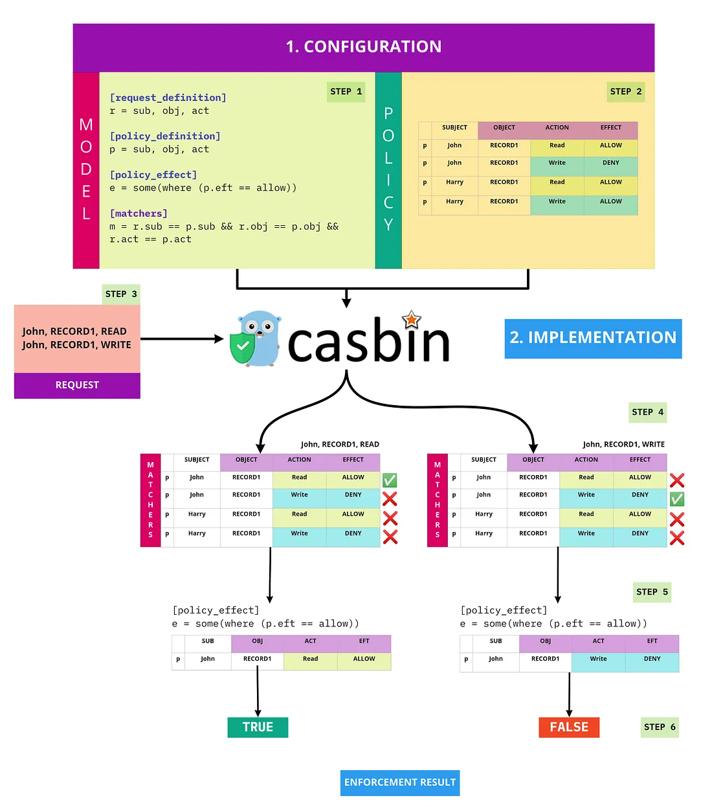

# Casbin in a nutshell



## Example 1: simple case

```bash
[request_definition]
r = sub, obj, act

[policy_definition]
p = sub, obj, act

[role_definition]
g = _, _   # this line defines the "g" policy type

[policy_effect]
e = some(where (p.eft == allow))

[matchers]
m = g(r.sub, p.sub) && r.obj == p.obj && r.act == p.act
```

## Example 2: IP-based access

```bash
[request_definition]
r = sub, obj, act, ip

[policy_definition]
p = sub, obj, act, ip

[matchers]
m = r.sub == p.sub && r.obj == p.obj && r.act == p.act && r.ip == p.ip

p, alice, /admin, GET, 192.168.1.10
```

## Example 3: Add attributes (ABAC style)

Suppose you want to allow access only during working hours:

```bash
[request_definition]
r = sub, obj, act, t

[policy_definition]
p = sub, obj, act, t

[matchers]
m = r.sub == p.sub && r.obj == p.obj && r.act == p.act && r.t >= 9 && r.t <= 17

e.Enforce("alice", "/report", "read", 10) // 10 AM → allowed
e.Enforce("alice", "/report", "read", 22) // 10 PM → denied
```
